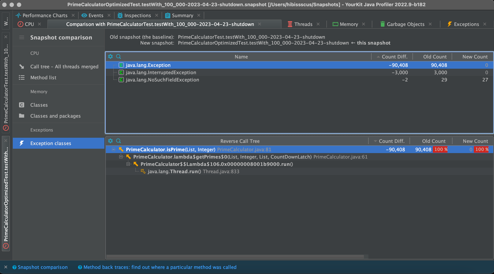

🔍🕵️‍♂️📋️ **Performance Investigatio
n** of  [PrimeCalculator](https://github.com/hibissscus/performance/blob/master/src/main/java/PrimeCalculator.java)
=================================

CPU hot spots of performance test results generated by profiler [YourKit](https://www.yourkit.com/java/profiler/) for max prime number **100000**

CPU call tree by thread for max prime number **100000**

Memory for max prime number **100000**

List of performance issues:
=================================
📉 **CPU high load**: a lot of CPU time spent on the collection synchronization based on CPU hot spots 

🧠💥 **Out of memory**: heap space issue due too many new instances of ***BigIntegerIterator*** object creation in case of big prime number (ex. 1000000)  

🏋️‍♂️ **Too ambition thread pool size**: thread pool size can be too big in case of big prime number (ex. 1000000) 

💰 **Expensive operation**: inside **isPrime** method expensive operation ***subList*** is used inside the for-loop

🔡 **Excess concatenation**: instead of concatenations **System.out.println(prime)** can be used

Code style refactoring:
=================================
🚫 **Unnecessary class BigIntegerIterator**: this class is redundant, but still if needed to use it some code can be refactored

🚨 **Unnecessary use of Exception**: would be better to use boolean as a return value instead of exceptions

Optimized version of [PrimeCalculator](https://github.com/hibissscus/performance/blob/master/src/main/java/PrimeCalculatorOptimized.java)
=================================
Here are some potential improvements that could be made to the code:

- **Use a more efficient algorithm for finding primes**: The current implementation uses a simple trial division approach, which is slow for large values of maxPrime.

- **Remove unnecessary synchronization**: [PrimeCalculatorSimple.java](https://github.com/hibissscus/performance/blob/master/src/main/java/PrimeCalculatorSimple.java)
- **Use the IntStream instead of Stream**: Since the BigIntegerIterator class is only used to generate a sequence of integers, to simplify the code by using the IntStream class instead of the Stream class. This can make the code more concise and easier to read. 

- **Remove unnecessary Exception handling**: The isPrime method throws an Exception when a non-prime number is found, but this is unnecessary since the method is only called in a try-catch block, and the caught exception is ignored. Instead of throwing an exception, the method could return a boolean value indicating whether the number is prime or not.

- **Full version of optimized class**: [PrimeCalculatorOptimized.java](https://github.com/hibissscus/performance/blob/master/src/main/java/PrimeCalculatorOptimized.java)

Performance improvement after optimization:
=================================
🚀 **Execution time improvement**: significant improvement on time of the program execution (ex. 100000) 

🧠 **Heap size memory improvement**: less unnecessary object was created after optimization  

✅ **Less exceptions**: less unnecessary exceptions generated during execution 

### Authors

© 2023 [Sergei Stepanov](https://github.com/hibissscus) (implementation & enhancement)
