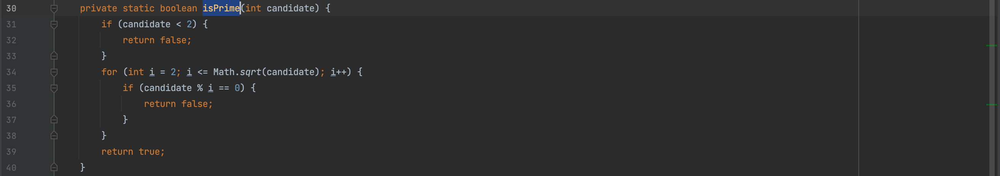
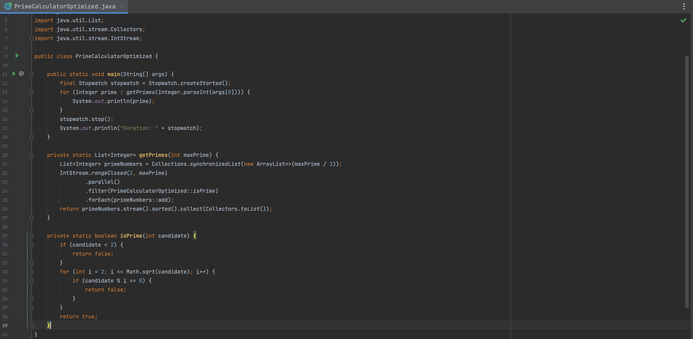

🔍🕵️‍♂️📋️ **Performance Investigation** of  [PrimeCalculator](https://github.com/hibissscus/performance/blob/master/src/main/java/PrimeCalculator.java)
=================================

CPU hot spots of performance test results generated by profiler [YourKit](https://www.yourkit.com/java/profiler/) for max prime number **100.000**

CPU call tree by thread for max prime number **100.000**

Memory for max prime number **100.000**

List of performance issues:
=================================
📉 **CPU high load**: a lot of CPU time spent on the collection synchronization based on CPU hot spots 

🧠💥 **Out of memory**: heap space issue due too many new instances of ***BigIntegerIterator*** object creation in case of big prime number (ex. 1000000)  

🏋️‍♂️ **Too ambition thread pool size**: thread pool size can be too big in case of big prime number (ex. 1.000.000) 

💰 **Expensive operation**: inside **isPrime** method expensive operation ***subList*** is used inside the for-loop

🔡 **Excess concatenation**: instead of concatenations **System.out.println(prime)** can be used

Code style refactoring:
=================================
🚫 **Unnecessary class BigIntegerIterator**: this class is redundant, but still if needed to use it some code can be refactored

🚨 **Unnecessary use of Exception**: would be better to use boolean as a return value instead of exceptions

Optimized version of [PrimeCalculator](https://github.com/hibissscus/performance/blob/master/src/main/java/PrimeCalculatorOptimized.java)
=================================
Here are some potential improvements that could be made to the code:

💻 **Use a more efficient algorithm for finding primes**: current implementation uses a simple trial division approach, which is slow for large values of maxPrime.

🎯 **Use the IntStream instead of Stream**: since the BigIntegerIterator class is only used to generate a sequence of integers, to simplify the code by using the IntStream class instead of the Stream class. This can make the code more concise and easier to read. 

✅ **Remove unnecessary Exception handling**: isPrime method throws an Exception when a non-prime number is found, but this is unnecessary since the method is only called in a try-catch block, and the caught exception is ignored. Instead of throwing an exception, the method could return a boolean value indicating whether the number is prime or not.

🤝 **Remove unnecessary synchronization**: [PrimeCalculatorSimple.java](https://github.com/hibissscus/performance/blob/master/src/main/java/PrimeCalculatorSimple.java)

🚀 **Full version of optimized class**: [PrimeCalculatorOptimized.java](https://github.com/hibissscus/performance/blob/master/src/main/java/PrimeCalculatorOptimized.java)

🚀 **Full version of optimized class**: [PrimeCalculatorOptimizedV2.java](https://github.com/hibissscus/performance/blob/master/src/main/java/PrimeCalculatorOptimizedV2.java)

Performance improvement after optimization:
=================================
🚀 **Execution time improvement**: significant improvement on time of the program execution (ex. 100.000) 

🧠 **Heap size memory improvement**: less unnecessary object was created after optimization (ex. 100.000)  

💾 **Memory comparison**: for original version with maxPrime (ex. 100.000) and optimized version (100.000.000)

✅ **Fewer exceptions**: less unnecessary exceptions generated during execution 

Next version of optimization [Sieve of Eratosthenes](https://github.com/hibissscus/performance/blob/master/src/main/java/PrimeSieveOfEratosthenes.java):
=================================
🧺 **Sieve of Eratosthenes**: the algorithm works by iteratively marking the multiples of each prime number as composite, starting from the smallest prime (2) and continuing until the square of the current prime exceeds the given limit.

- Create a list of consecutive integers from 2 to the given limit.
- Let the current prime number be initialized as 2.
- Mark all the multiples of 2 as composite (not prime).
- Find the next prime number (the smallest number greater than the current prime that is not marked as composite).
- Repeat steps 3 and 4 until the square of the current prime exceeds the given limit.
- All the remaining unmarked numbers in the list are prime numbers.

🚀 **Execution time improvement**: significant improvement on time of the program execution (ex. 100.000) 
### Authors

© 2023 [Sergei Stepanov](https://github.com/hibissscus) (implementation & enhancement)
